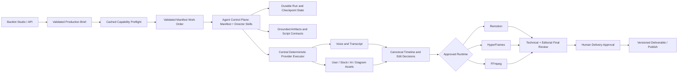

# OpenMontage Production Readiness Roadmap

Status: Proposed execution roadmap

Scope: Current OpenMontage working tree, including Backlot, pipeline manifests, provider registry, stock and AI media, voice-over, Remotion, HyperFrames, FFmpeg, audio, QA, packaging, and operations

Primary objective: Make every advertised video workflow fast, accurate, recoverable, observable, and safe to operate in production

## How to execute this roadmap with GPT-5.6 Luna Max

This file is the program-level roadmap and architectural source of truth. It is accompanied by three execution documents:

- [`production-readiness/EXECUTION_PLAYBOOK.md`](production-readiness/EXECUTION_PLAYBOOK.md) — the exact agent operating contract, task order, file targets, implementation instructions, validation commands, stop conditions, and phase gates.
- [`production-readiness/PROGRESS_TRACKER.md`](production-readiness/PROGRESS_TRACKER.md) — the only status ledger. Luna must update it with evidence after each completed task; a checkbox without evidence is not completion.
- [`production-readiness/ACCEPTANCE_MATRIX.md`](production-readiness/ACCEPTANCE_MATRIX.md) — the certification matrix that decides release readiness across pipelines, providers, media sources, runtimes, formats, failure recovery, QA, and operations.

When handing the program to GPT-5.6 Luna Max, give it this instruction:

> Execute OpenMontage production readiness from the repository roadmap. Read `AGENTS.md`, the complete `AGENT_GUIDE.md`, `PROJECT_CONTEXT.md`, `docs/PRODUCTION_READINESS_ROADMAP.md`, and all three files under `docs/production-readiness/` before changing source code. Preserve the agent-first architecture: the AI agent orchestrates pipeline stages; Python owns tools, validation, persistence, media processing, job safety, and deterministic enforcement, not creative direction. Select only the next dependency-ready task in `PROGRESS_TRACKER.md`, write or identify the failing test first, implement the smallest complete fix, run the task gate, record exact evidence, and stop at every defined human decision or release gate. Never claim a task or phase complete without its stated tests and artifacts. Never silently change providers, runtimes, formats, voices, or approved product scope. Do not commit, push, call paid providers, modify credentials, or discard existing work unless the user explicitly authorizes that action.

The playbook is deliberately sequential through Phases 0-3. Later workstreams may run in parallel only where this roadmap explicitly permits it.

## 1. Executive decision

OpenMontage should not be released as a production video-creation system until the user-facing Studio and the underlying multi-provider architecture become one execution system.

The repository already contains most of the required capabilities, but production readiness is blocked by integration and truthfulness failures:

- Backlot advertises multiple pipelines but launches one hardcoded runner.
- Several advertised formats cannot pass the runner's fixed stage sequence.
- The normal Remotion path currently fails before rendering.
- Voice, duration, style, stock, AI media, music, captions, and runtime choices are not consistently honored.
- Retry, fallback, idempotency, and resume contracts are not centrally enforced.
- HyperFrames does not yet preserve the full audio/edit contract.
- Human approvals and final QA do not reliably block unsafe delivery.
- A failed rerender can be mistaken for success when an older output exists.

This roadmap fixes those structural problems before expanding production volume.

## 2. Production-readiness invariants

These are non-negotiable system rules. A phase is not complete if it violates one of them.

1. **One selection, one real execution path.** A pipeline, runtime, provider, voice, profile, or format shown in the UI must be the one actually executed.
2. **No silent substitution.** Provider, runtime, media type, or delivery-promise changes require an explicit decision record and approval when material.
3. **No stale deliverables.** A run succeeds only when it creates and validates a new output associated with its own run ID.
4. **Facts require grounding.** Educational, documentary, factual, and company claims must be traceable to approved source material.
5. **Duration is a contract.** Short-form and platform profiles must meet their declared timing tolerance; scripts are edited to fit instead of stretching scenes.
6. **Paid work is idempotent.** A retry or process restart must not repeat a successful paid generation call.
7. **Every run is isolated.** Concurrent projects cannot share mutable staging files, props files, output names, or cleanup directories.
8. **Approval is a state transition.** A gated stage pauses, records who approved what, then resumes from the approved checkpoint.
9. **`revise` is not success.** Any critical QA result blocks presentation and completion.
10. **Capabilities are reported honestly.** Configured, reachable, degraded, unavailable, and untested are different states.
11. **Every production action is observable.** Operators can trace inputs, provider decisions, attempts, cost, artifacts, errors, approvals, and final QA.
12. **No advertised workflow without certification.** Experimental pipelines remain hidden or clearly labelled until their release matrix passes.

## 3. Target release architecture

OpenMontage remains agent-first. The LLM agent owns orchestration, creative decisions, review, and stage progression by following manifests and director skills. Deterministic Python services own validation, persistence, run isolation, timing calculations, retries, caching, media probing, cost accounting, and enforcement of release gates. This roadmap must not introduce a Python creative orchestrator, reviewer, or hardcoded universal content runner.

## 4. Delivery sequence and milestones

| Phase | Indicative duration | Primary outcome | Maturity unlocked |
|---|---:|---|---|
| 0. Baseline and release control | 2-3 engineering days | Reproducible baseline and visible release blockers | Controlled development |
| 1. Pipeline truth and manifest execution | 5-8 days | Backlot launches the selected, valid pipeline | Execution foundation |
| 2. Job isolation and Remotion recovery | 5-8 days | Safe, fresh, concurrent Remotion renders | Internal render alpha |
| 3. Provider execution kernel and fast preflight | 5-8 days | Enforced retry, idempotency, fallback, cost, and capability truth | Provider alpha |
| 4. Grounded content, format, and duration engine | 7-12 days | Accurate scripts and format-compliant timelines | Content alpha |
| 5. Voice-over reliability and resumability | 5-8 days | Selected voice is honored, cached, transcribed, and verified | Narrated alpha |
| 6. Stock, AI, user-media, and diagram orchestration | 7-12 days | Reliable multi-source visual acquisition and approval | Visual beta |
| 7. HyperFrames production hardening | 5-8 days | Audio-correct, offline-capable, validated HyperFrames rendering | Dual-runtime beta |
| 8. Music, captions, and audio finishing | 5-8 days | Complete and measurable sound/caption delivery | Feature-complete beta |
| 9. Real approvals and final quality gate | 7-10 days | Critical defects cannot be presented as finished | Release candidate |
| 10. Packaging, performance, security, and operations | 7-10 days | Reproducible deployment with SLOs and observability | Operational RC |
| 11. Certification, canary, and production launch | 7-14 days | Evidence-backed go/no-go decision and controlled rollout | Production |

Indicative total:

- Three to four focused engineers: approximately 10-14 calendar weeks, with safe parallel work after Phase 3.
- One senior engineer: approximately 18-24 weeks.
- External provider approval, quota, or procurement time is excluded.

## Phase 0 — Baseline and release control

### Purpose

Stop the current system from being mistaken for a production release while preserving a reproducible baseline for every fix.

### Deliverables

- Mark the current Studio as development or internal-preview only.
- Create one traceability register mapping every audit finding to:
  - severity;
  - owner role;
  - implementation ticket;
  - regression test;
  - release phase;
  - current status.
- Define which pipelines are intended for the first production launch and which remain experimental.
- Remove `framework-smoke` and any other test-only pipeline from user-facing discovery.
- Capture golden briefs and expected artifacts for at least:
  - 15-second vertical short;
  - 30-second educational explainer;
  - 60-second stock-footage documentary;
  - talking-head or avatar video;
  - screen demonstration;
  - mixed stock plus AI video;
  - HyperFrames kinetic-typography video;
  - five-minute lesson.
- Record current test, latency, render, cost, and provider-availability baselines.
- Add a release-blocker label and a rule that P0/P1 failures cannot be waived without a written decision.

### Exit gate

- Every confirmed audit finding has a ticket and regression-test owner.
- Unsupported pipelines are no longer presented as ready.
- Golden inputs and expected outputs are versioned and reproducible.
- The release status is unambiguously non-production.

## Phase 1 — Pipeline truth and manifest-driven execution

### Purpose

Make the selected production structure determine the actual stage sequence, skills, tools, runtime options, artifacts, and checkpoints.

### Deliverables

- Remove the hardcoded generic Studio runner from the production path. Replace it with a validated, durable manifest work order that the agent control plane can claim and execute stage by stage.
- Keep `lib/project_pipeline.py` explicitly quarantined as an internal demo or golden-fixture runner until it is either decomposed into deterministic services or removed from the production path; it must not impersonate every pipeline.
- Validate `pipeline_type`, playbook, voice, output profile, and runtime before creating a project directory.
- Return HTTP 4xx for an unknown, invalid, hidden, or unsupported selection.
- Correct the `documentary-montage` category/schema mismatch.
- Add manifest fields such as:
  - `ui_visible`;
  - `maturity` (`experimental`, `beta`, `production`);
  - `supported_runtimes`;
  - `required_capabilities`;
  - `required_artifacts`;
  - `supported_profiles`.
- Ensure every stage declared by the manifest is entered in order and cannot be skipped silently.
- Separate `idea` and `proposal` pipelines correctly rather than forcing one name on all workflows.
- Execute specialized stages where applicable, including research, character design, rig planning, source-media review, localization, and publish.
- Make Backlot discovery use the same validated loader as production execution.
- Add a manifest-to-agent-contract compatibility validator that proves each declared stage has a director skill, canonical artifact contract, permitted tool set, checkpoint behavior, and production support status.
- Preserve pipeline-specific artifacts rather than rewriting every format into teacher slides.

### Required tests

- Every UI-visible pipeline validates against its schema.
- Every UI-visible pipeline launches its declared first stage.
- Every declared stage has an executable handler.
- Invalid pipeline/playbook/runtime/profile requests fail before project creation.
- Each pipeline creates a distinct production plan and renderer family.
- No required stage is absent from the completed run history.

### Exit gate

- 100% of visible pipeline selections execute their own manifest.
- Zero visible pipelines silently fall back to the canonical generic stage list.
- The Backlot card, project marker, proposal, edit decisions, and run logs agree on pipeline identity.

## Phase 2 — Durable jobs, artifact integrity, and Remotion recovery

### Purpose

Restore the default renderer and eliminate stale outputs, duplicate jobs, shared staging, and unsafe cleanup.

### Deliverables

- Fix the Remotion undefined-variable failure and make all diagnostic tests pass.
- Introduce immutable `run_id` values and associate every artifact with a project ID and run ID.
- Add a durable job registry with explicit states:
  - queued;
  - preflighting;
  - running;
  - awaiting approval;
  - revising;
  - failed;
  - cancelled;
  - completed.
- Enforce one active job per project unless the user explicitly creates a variant or branch.
- Make `/run` idempotent and return the active job rather than spawning duplicate processes.
- Add cancellation, timeout, restart recovery, and durable stdout/stderr logs.
- Use a per-run Remotion workspace, staging directory, props filename, and cleanup boundary.
- Stage assets using hashes or asset IDs, never basename alone.
- Derive render concurrency from the machine/resource profile instead of hardcoding eight workers.
- Render to a temporary output, validate it, then atomically promote it to the final versioned path.
- Require proof that the output was created by the current run:
  - run ID metadata;
  - creation timestamp after job start;
  - non-zero size;
  - valid media probe;
  - checksum recorded in the render report.
- Never accept an older `final.mp4` after a failed render.
- Keep the last known-good deliverable as a separate version, never as evidence that the new run succeeded.

### Required tests

- Normal Remotion render and all Remotion diagnostic tests pass.
- A forced render failure with an older output present remains failed.
- Three simultaneous projects do not share or delete staged assets.
- Two clicks on Run create one job.
- A process restart resumes or cleanly fails the job without repeating completed paid work.
- Cleanup removes only the current run's temporary files.

### Exit gate

- Remotion produces a verified new output for every successful test run.
- Zero stale-output false successes.
- Zero cross-project staging collisions under the concurrency test.
- An operator can cancel, inspect, and restart a job from durable state.

## Phase 3 — Central provider execution kernel and fast preflight

### Purpose

Turn provider metadata into enforced runtime behavior across TTS, images, video, stock, music, subtitles, analysis, and publishing.

### Deliverables

- Create one central `ProviderExecutor` used by all selectors and pipelines.
- Enforce, centrally:
  - input-schema validation;
  - availability state;
  - bounded timeouts;
  - retry classification;
  - exponential backoff and jitter;
  - circuit breaking;
  - rate-limit handling;
  - idempotency keys;
  - result caching;
  - resume tokens/job IDs;
  - cost and quota accounting;
  - output validation;
  - structured error categories;
  - decision-log updates.
- Make selectors return a ranked execution plan and alternatives before spending money.
- Honor an explicitly selected provider when it is compatible and available.
- Require approval before a material provider or media-type fallback.
- Distinguish these capability states:
  - configured;
  - dependency-ready;
  - reachable;
  - quota-ready;
  - degraded;
  - unavailable;
  - not recently tested.
- Split cheap local checks from network health probes.
- Run independent health probes concurrently with bounded budgets.
- Cache health results with TTLs and refresh them asynchronously.
- Move slow npm/provider probes out of the synchronous Studio launch path.
- Add a provider-status panel to Backlot showing what is available, unavailable, degraded, or untested.
- Do not expose credentials or raw provider error bodies in user-facing output.

### Performance targets

- Warm preflight p95: under 2 seconds.
- Cold local capability discovery p95: under 5 seconds.
- Optional external health refresh: under 15 seconds and never blocks opening the Studio.
- No individual probe may extend the global deadline through child-process leakage.

### Required tests

- Injected timeout retries only retryable failures.
- A completed paid operation is reused after process restart.
- A failed provider can move to an approved fallback without losing provenance.
- An unapproved runtime or media-type downgrade is blocked.
- Circuit breakers open and recover deterministically.
- Preflight latency meets the target on Windows and Linux.

### Exit gate

- All selectors execute through the central kernel.
- Retry, fallback, idempotency, and cost controls are behavior, not descriptive metadata.
- Provider status is fast and truthful.

## Phase 4 — Grounded content, format, and duration engine

### Purpose

Replace generic filler with accurate, audience-specific, source-grounded content and timelines that meet the selected format.

### Deliverables

- Introduce a validated production brief containing:
  - objective;
  - audience;
  - factuality level;
  - approved sources;
  - key claims;
  - tone;
  - platform/profile;
  - target duration and tolerance;
  - aspect ratio;
  - language;
  - accessibility requirements;
  - delivery promise.
- Build source ingestion and retrieval for user files, approved web research, curriculum/company material, and project knowledge bases.
- Require claim-level source references for factual and educational scripts.
- Fail safely when verified material is insufficient instead of generating plausible filler.
- Move the epidemiology lesson into a reusable content fixture/template rather than a special case in the production runner.
- Generate script, scene objectives, visual evidence needs, and narration from the approved content brief.
- Add content-review checks for unsupported claims, contradictions, duplicated beats, weak transitions, and missing takeaways.
- Create explicit output profiles for landscape, portrait, square, short-form, long-form, platform safe areas, resolution, fps, and caption policy.
- Replace the conflicting two-second cadence/3.5-second minimum logic with a duration solver.
- The solver must:
  - estimate speech using provider-specific rate;
  - reserve intro/outro and transition budgets;
  - constrain scene count and scene duration;
  - rewrite or trim the script to fit;
  - remeasure after TTS;
  - request approval if the brief cannot fit without losing required content.

### Accuracy and timing targets

- Factual golden set: zero unsupported material claims.
- Script-to-source claim coverage: 100% for claims marked factual.
- 15/30/60/90-second profiles: within ±5% or ±1 second, whichever is larger.
- Long-form profiles: within ±3%, unless the user explicitly approves content-led expansion.
- No repeated placeholder narration in production artifacts.

### Exit gate

- At least 25 diverse golden topics pass content review.
- The same topic can be correctly expressed as a short, explainer, documentary, or lesson without generic repeated beats.
- Duration profiles meet their tolerance after final narration.

## Phase 5 — Voice-over correctness, caching, and resumability

### Purpose

Make the selected voice and delivery contract authoritative from the Studio through the final video.

### Deliverables

- Persist provider, model, voice ID, language, style, speed/rate, pronunciation settings, and consent/provenance where applicable.
- Make the Studio list voices from currently available TTS providers rather than presenting one provider while executing another.
- Route all narration through the provider selector and central executor.
- Generate and approve a short voice sample before full narration when the workflow requires it.
- Cache narration chunks using a hash of normalized text plus all audible settings.
- Resume at the failed segment without regenerating successful segments.
- Use safe, deterministic audio assembly instead of stream-copying independently encoded MP3 chunks.
- Normalize to the selected loudness standard while preserving natural dynamics.
- Add a pronunciation lexicon for names, technical terms, abbreviations, local languages, and organization-specific wording.
- Produce a word- or segment-level transcript tied to the actual rendered audio.
- Compare transcript to the approved script and block material omissions, substitutions, punctuation leakage, or language mismatch.
- Keep actual provider settings separate from generic metadata; do not report unused OpenAI parameters for Edge output.

### Required tests

- The chosen UI voice is the voice recorded in the asset and decision log.
- Edge works in a clean baseline installation without requiring OpenAI.
- Cloud TTS remains optional and cannot be selected when unconfigured.
- Failure at segment 15 resumes at segment 15 with no duplicate charges for segments 1-14.
- Transcript accuracy passes defined thresholds across accents, names, numbers, dates, and abbreviations.

### Exit gate

- Selected-provider fidelity is 100% in the golden suite.
- No repeated successful TTS charges after retry/restart.
- Material transcript mismatch blocks compose.

## Phase 6 — Stock, AI, user-media, and diagram orchestration

### Purpose

Make all visual sources available through one scene-level acquisition and approval workflow.

### Deliverables

- Add a visual strategy per scene:
  - user-provided media;
  - stock image;
  - stock video;
  - AI image;
  - AI video;
  - diagram/chart/map;
  - screen capture;
  - text/motion graphic.
- Let the production brief define allowed and prohibited source types.
- Route image/video generation through the central provider executor.
- Integrate direct stock acquisition and corpus retrieval into the manifest-driven asset stage.
- Search multiple suitable stock sources without presenting "configured" as proof of live success.
- Download to `.part` files and atomically promote only after validation.
- Validate:
  - MIME/magic bytes;
  - image decode or ffprobe;
  - duration;
  - dimensions;
  - fps;
  - corruption;
  - checksum;
  - orientation/profile compatibility.
- Never reuse an incomplete download based only on file size.
- Record source URL, creator, license, attribution requirements, query, provider, model, prompt, seed, generation settings, checksum, and approval status.
- Add deduplication and near-duplicate detection across scenes.
- Add safe crop/reframe/transcode preparation before composition.
- Generate a contact sheet or preview reel for human asset approval.
- Keep alternatives and rejected candidates so revisions do not repeat search/generation unnecessarily.
- Block a motion-required brief from silently degrading to still images.

### Required scenario tests

- User-media-only production.
- Keyless/open-stock production.
- Pexels/Pixabay production when configured.
- AI-image-only production.
- AI-video production.
- Mixed stock, AI, diagrams, and user media.
- Provider failure after some scenes complete, followed by resume.
- Licensing/attribution export.

### Exit gate

- Every scene asset is valid, traceable, approved, and compatible with the output profile.
- No corrupt partial download is accepted.
- No material source-type downgrade occurs without approval.

## Phase 7 — HyperFrames production hardening

### Purpose

Bring HyperFrames to parity with the canonical edit/audio contract and make it reliable for video-heavy, offline, and concurrent rendering.

### Deliverables

- Preserve and apply narration `offset_seconds` for master-audio segments.
- Apply music offset, fade-in, fade-out, looping, volume, and ducking.
- Bundle or locally resolve GSAP; final rendering must not depend on a public CDN.
- Make lint strict for delivery renders.
- Run the full required sequence:
  - scaffold;
  - lint;
  - validate;
  - inspect;
  - render;
  - post-render review.
- Treat unsupported cut shapes as blocking schema/renderer errors rather than successful placeholder substitutions.
- Hash staged asset names and isolate each run's workspace.
- Pre-encode stock video with dense keyframes when required.
- Automatically select safe worker counts; use one worker for video-heavy compositions unless benchmark evidence supports more.
- Add resource-budget enforcement for memory, disk, process count, and render timeout.
- Make runtime installation/doctor checks explicit and cached rather than using a slow network probe on every preflight.
- Verify that computed dimensions, fps, duration, transitions, composition IDs, nested HTML, and audio align with the canonical artifacts.

### Required tests

- One master narration file split into segments plays the correct offset for every scene.
- Music fades and ducking match the edit decisions.
- Rendering succeeds without internet access after dependencies are installed.
- A video-heavy composition with long-GOP stock footage completes without frozen sections.
- Unknown cuts fail before render.
- Two concurrent HyperFrames projects do not share assets or workspaces.

### Exit gate

- HyperFrames golden projects pass audiovisual sync and frame inspection.
- Offline render is repeatable.
- HyperFrames and Remotion both consume the same canonical timing/audio semantics.

## Phase 8 — Music, captions, and audio finishing

### Purpose

Complete the audiovisual product rather than treating narration presence as complete sound design.

### Deliverables

- Make the proposal include a mandatory music plan for any pipeline with audio.
- Expose available library, royalty-free, generated, or user-provided music choices.
- Keep narration, music, ambience, and SFX as separate logical stems through mixdown.
- Implement measurable ducking and role-specific levels.
- Apply fade curves, offsets, loop policy, and scene transitions consistently across runtimes.
- Produce word-level or segment-level captions from the verified narration transcript.
- Support burned-in captions and sidecar files according to the output profile.
- Enforce caption safe areas, maximum line length, reading speed, contrast, and synchronization.
- Add loudness, true-peak, silence, clipping, channel, and intelligibility checks.
- Verify narration and music independently instead of inferring both from one overall volume value.

### Audio targets

- Default web narration mix: approximately -16 LUFS integrated unless the profile specifies otherwise.
- True peak: at or below -1.5 dBTP.
- No unintended silence or clipped speech.
- Captions cover all approved narration within the configured synchronization tolerance.

### Exit gate

- Narration, music, and captions are independently verified.
- Every audible/captioned element matches the approved artifact and output profile.
- Missing or incorrect captions/music cannot be marked complete when expected.

## Phase 9 — Real human gates and trustworthy final review

### Purpose

Make approval and final QA enforceable state transitions rather than metadata or optimistic heuristics.

### Deliverables

- Replace caller-supplied `human_approved=True` shortcuts with immutable approval records containing:
  - stage and artifact version;
  - approver identity;
  - timestamp;
  - decision;
  - notes;
  - approved checksum/version.
- Make the Backlot Approve action transition `awaiting_human` to `completed` and resume the next stage exactly once.
- Make revision create a new artifact version while preserving the approved/rejected history.
- Persist the canonical `final_review.json` and display it on the board.
- Make `revise` and `fail` block completion and presentation.
- Replace file-size frame heuristics with actual analysis for:
  - black/blank/frozen frames;
  - missing media;
  - duplicate shots;
  - broken overlays;
  - unreadable or clipped text;
  - safe-area violations;
  - incorrect aspect ratio;
  - transition defects;
  - watermarks or unexpected placeholders.
- Compare actual audio transcript to the approved script.
- Verify narration, music, subtitle, codec, resolution, fps, duration, and output profile from real streams.
- Compare proposal promise, scene plan, asset manifest, edit decisions, render report, and final output for cross-artifact consistency.
- Add reviewer-visible sampled frames, waveform/loudness evidence, transcript differences, and recommended actions.

### Eval harness

- Maintain a golden media set with intentionally injected defects.
- Measure false negatives and false positives for every automated QA detector.
- Run visual and audio regressions on every renderer, timeline, caption, or media-profile change.
- Require human review for high-impact false-negative classes until automation is proven.

### Exit gate

- All injected critical defects are blocked.
- `revise` cannot produce a completed compose/publish checkpoint.
- Approval and resume work correctly across process restart.
- The operator can explain exactly why a project passed or failed.

## Phase 10 — Packaging, performance, security, and operations

### Purpose

Make the certified workflows reproducible on a clean machine and operable under sustained use.

### Deliverables

- Add all mandatory runtime dependencies, including Edge TTS where imported by the baseline path.
- Separate core, provider, local-GPU, development, and optional extras cleanly.
- Pin/lock production dependencies and define a supported Python/Node/FFmpeg/browser matrix.
- Include schemas, manifests, styles, Backlot UI, templates, and other non-Python assets in package builds.
- Add clean-install, wheel-install, and Docker smoke tests.
- Verify Remotion browser/system-library requirements inside the production image.
- Add database-backed or durable job state appropriate to the deployment model.
- Add authentication, authorization, CSRF protection, rate limits, and project isolation before any non-local deployment.
- Store secrets only in the environment/secret manager; redact logs and exported diagnostics.
- Validate upload type/size, media paths, archive extraction, provider URLs, and generated HTML.
- Add retention, cache eviction, temporary-file cleanup, project archival, backup, and disaster-recovery policies.
- Add structured tracing and metrics for:
  - job and stage latency;
  - provider attempts and failures;
  - retry/fallback/circuit-breaker events;
  - render time and resource use;
  - preflight latency;
  - cache hit rate;
  - cost by project/provider/scene;
  - QA failures;
  - approval wait time;
  - cancellation and recovery.
- Add operator dashboards, alerts, runbooks, and provider outage playbooks.
- Benchmark and optimize:
  - provider preflight;
  - narration caching;
  - stock result/download caching;
  - parallel independent asset work;
  - renderer concurrency;
  - disk usage and cleanup.

### Operational targets

- Warm Studio/preflight p95 under 2 seconds.
- Job acceptance p95 under 2 seconds.
- No duplicate paid operation for the same idempotency key.
- Three concurrent reference workloads complete without cross-project interference.
- 100% of failed jobs have a structured terminal reason and last successful checkpoint.
- Clean Docker and clean Windows installation pass the supported smoke suite.

### Exit gate

- A clean environment can install, start, produce, review, and export the baseline golden project using documented commands.
- Operators can detect and diagnose provider, renderer, disk, quota, and queue failures.
- Security review has no unresolved critical/high findings for the intended deployment boundary.

## Phase 11 — Certification, canary, and production launch

### Purpose

Prove the complete system under realistic diversity and load before declaring production readiness.

### Certification matrix

Run at least 50 versioned projects covering:

- all production-visible pipelines;
- Remotion, HyperFrames, and applicable FFmpeg paths;
- landscape, portrait, square, short-form, and long-form profiles;
- Edge/local and at least one configured cloud TTS provider;
- user media, keyless stock, configured commercial stock, AI images, AI video, diagrams, and mixed assets;
- captions on/off and music on/off;
- provider timeout, quota failure, corrupt asset, renderer crash, process restart, cancellation, and resume;
- concurrent jobs;
- low-resource machine profile;
- offline-capable path;
- educational/factual and creative/non-factual briefs.

### Release gates

- Full automated suite is green with no unexplained skips.
- No unresolved P0 or P1 findings.
- 100% manifest/schema compatibility for production-visible pipelines.
- 100% selected-provider/runtime fidelity.
- 100% new-output provenance; zero stale-output false success.
- Duration and content-grounding targets pass.
- Critical injected defects are blocked by final QA.
- First-attempt success meets the agreed service target; retry/recovery success is measured separately.
- Cost and latency remain within the approved envelopes.
- Operator, rollback, backup, incident, and provider-outage runbooks are tested.
- Product, engineering, QA, operations, and content owners sign the go/no-go record.

### Rollout sequence

1. Internal dogfood: 10-20 real projects.
2. Closed alpha: trusted creators with direct engineering support.
3. Limited beta: capped concurrency, capped spend, monitored providers, no automatic publishing.
4. Release candidate: production infrastructure with a controlled user cohort.
5. General production: only after the certification gates remain green for the agreed observation period.

### Automatic rollback triggers

- stale or wrong deliverable shown to a user;
- selected voice/provider/runtime not honored;
- cross-project asset or output contamination;
- unsupported factual content presented as verified;
- duplicate paid generation caused by retry/restart;
- critical QA defect marked complete;
- unrecoverable job-state corruption;
- secret exposure or unauthorized project access.

## 5. Parallel work that is safe

Do not parallelize foundational contract changes until Phases 1-3 stabilize. After the manifest work-order contract, job model, and provider executor are accepted, these workstreams can proceed in parallel:

| Workstream | Earliest safe start | Dependencies |
|---|---|---|
| Grounded content and duration | After Phase 1 interface freeze | Brief and artifact contracts |
| Voice-over | After Phase 3 executor contract | Provider executor and job resume |
| Visual acquisition | After Phase 3 executor contract | Provider executor and asset schema |
| HyperFrames | After Phase 2 run isolation | Canonical edit/audio contract |
| Music and captions | After Phase 5 transcript contract | Voice timeline and audio schema |
| Final QA | Prototype during earlier phases; certify after Phase 8 | Stable outputs from every path |
| Packaging/operations | Begin early; certify after Phase 9 | Stable runtime and job contracts |

## 6. Finding-to-phase traceability

| Confirmed problem | Owning phase |
|---|---|
| Backlot always launches one runner | Phase 1 |
| Advertised pipeline stage mismatch | Phase 1 |
| Invalid documentary manifest | Phase 1 |
| Format/playbook/runtime choices ignored | Phases 1 and 4 |
| Remotion undefined variable | Phase 2 |
| Shared Remotion staging and fixed concurrency | Phase 2 |
| Duplicate `/run` processes | Phase 2 |
| Stale output accepted after failed render | Phase 2 |
| Retry/fallback/idempotency metadata not enforced | Phase 3 |
| Slow provider/HyperFrames preflight | Phase 3 |
| Generic non-epidemiology filler | Phase 4 |
| Duration options cannot meet their labels | Phase 4 |
| Microsoft voice UI defaults to OpenAI execution | Phase 5 |
| Serial TTS regeneration and unsafe MP3 concatenation | Phase 5 |
| Stock/AI/user media disconnected from Backlot | Phase 6 |
| Partial stock downloads trusted by size | Phase 6 |
| HyperFrames narration offsets ignored | Phase 7 |
| HyperFrames fades, inspect, keyframes, workers, and offline dependency gaps | Phase 7 |
| No complete music/caption path in the Studio runner | Phase 8 |
| Human gates auto-approved | Phase 9 |
| Approve endpoint does not complete/resume the stage | Phase 9 |
| QA cannot truly detect visual/audio correctness | Phase 9 |
| `revise` still returns success | Phase 9 |
| Render report hardcodes or assumes media properties | Phase 9 |
| Missing mandatory dependencies/package data | Phase 10 |
| No production SLOs, deployment certification, or canary evidence | Phases 10 and 11 |

## 7. Recommended ownership

| Role | Primary accountability |
|---|---|
| Technical lead / architect | Invariants, contracts, phase gates, cross-runtime consistency, go/no-go |
| Pipeline/backend engineer | Manifest work orders, jobs, checkpoints, API validation, approvals, resume |
| Media/render engineer | Remotion, HyperFrames, FFmpeg, timeline, staging, media validation, audio mix |
| AI/content engineer | Grounding, retrieval, script generation, provider executor integration, evals |
| Frontend/product engineer | Backlot choices, capability truth, progress, approvals, QA evidence, accessibility |
| QA/evaluation engineer | Golden suite, fault injection, audiovisual regression, release certification |
| DevOps/security engineer | Packaging, secrets, deployment, observability, SLOs, backups, incident response |

If one person owns several roles, keep the same phase gates. Do not mark implementation and independent release verification complete in the same unchecked step.

## 8. First implementation sequence

The exact executable order lives in the progress tracker. Luna must begin at `PR-000`, not jump directly to a tempting renderer or provider fix.

1. Complete Phase 0 (`PR-000` through `PR-0G`) to capture the dirty-tree baseline, classify launch scope, create golden fixtures, and establish non-production labelling.
2. Complete the Phase 1 contract chain in dependency order: manifest metadata and validation (`PR-100`–`PR-102`), pre-mutation request validation (`PR-103`), durable work orders (`PR-104`), demo-runner quarantine (`PR-105`), agent-contract validation and identity propagation (`PR-106`–`PR-108`), then one manifest-faithful thin vertical (`PR-109`).
3. Pass `PR-1G` before touching the durable-render foundation as a program task.
4. Complete Phase 2 in order: Remotion recovery, run provenance, idempotency, per-run isolation, atomic output promotion, stale-output elimination, resume, media probing, and fault tests (`PR-200`–`PR-208`).
5. Pass `PR-2G`, then build and freeze the provider execution contract in Phase 3 (`PR-300`–`PR-310`, `PR-3G`).
6. Only after `PR-3G` may the grounded-content, voice, visual-source, HyperFrames, and operations workstreams proceed in the controlled parallel pattern defined by the tracker.

First major milestone: one intentionally supported pipeline can create one accurate, voice-correct, newly rendered, inspectable video without stale output, duplicate work, hidden provider/runtime switch, or bypassed checkpoint. This milestone is evidence of an internal alpha, not production readiness.

## 9. Final definition of production ready

OpenMontage is production ready only when all of the following are true:

- The user can see exactly which pipelines, providers, stock sources, AI generators, voices, runtimes, and formats are actually usable.
- Every visible selection is validated and honored end to end.
- The factual content path is grounded and refuses unsupported claims.
- Short and long formats meet their timing contracts.
- Voice, visuals, music, captions, style, and structure match their approved artifacts.
- Remotion, HyperFrames, and FFmpeg paths are isolated, deterministic enough for replay, and independently certified.
- Provider failure, process restart, user revision, and render failure can resume without corrupting artifacts or duplicating spend.
- No stale, downgraded, placeholder, unapproved, or critically defective output can be marked complete.
- Clean installation, deployment, monitoring, backup, rollback, and incident response are proven.
- The certification matrix passes and the canary period produces no unresolved release blocker.

Until those conditions are met, the correct label is internal preview, alpha, beta, or release candidate—not production ready.
